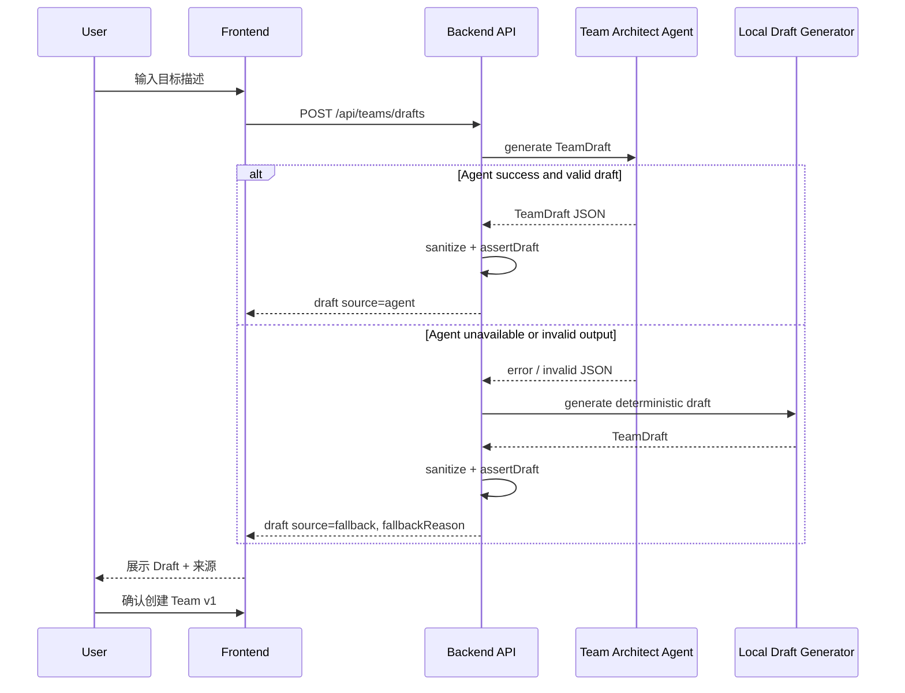

# F056: Team Draft Agent（团队草案架构师）

> **Status**: implemented | **Owner**: codex | **Priority**: P1

## Why

F055 已经让用户可以“只描述目标”创建 Team，但第一版 Team Draft 由本地规则生成，稳定但模板化。对于更具体的任务，比如“跨境电商选品团队”“客服机器人上线团队”“投融资尽调团队”，固定规则很难理解领域差异，也很难给出贴合场景的成员构成和 prompt。

F056 的目标是把 Draft 生成升级为：

> 由一个专门的 Team Architect Agent 分析目标并生成 Team Draft；如果 Agent 不可用或输出不合格，自动回退到 F055 的本地规则生成器，保证创建流程不断。

用户看到的入口不变：仍然只输入目标、审阅 Draft、确认后创建 Team v1。

## 需求点 Checklist

| ID | 需求点（铲屎官原话/转述） | AC 编号 | 验证方式 | 状态 |
|----|---------------------------|---------|----------|------|
| R1 | 创建 Team 时调用一个专门的 Team Architect Agent 生成 Draft | AC-A1, AC-A2 | test / log | [x] |
| R2 | Agent 生成的 Draft 比本地规则更贴合目标领域 | AC-B1, AC-B2 | manual / review | [x] |
| R3 | Agent 失败时必须 fallback，不让创建流程断掉 | AC-C1, AC-C2 | test | [x] |
| R4 | Agent 输出必须被校验和清洗，不能直接信任 | AC-D1, AC-D2 | test / review | [x] |
| R5 | 用户能知道 Draft 是 Agent 生成还是 fallback 生成 | AC-E1 | screenshot / test | [x] |

### 覆盖检查
- [x] 每个需求点都能映射到至少一个 AC
- [x] 每个 AC 都有验证方式
- [x] 前端需求已准备需求→证据映射表

## What

### Phase A: Team Architect Agent

新增一个系统内置的 **Team Architect Agent**，职责是根据用户目标生成 `TeamDraft`。

输入：

```text
goal: 用户目标描述
constraints:
  - team size target: 3-5
  - output schema: TeamDraft JSON
  - no auto merge / auto push / bypass confirmation
  - members are TeamVersion snapshots, not global Agents
```

输出必须匹配 F055 的 `TeamDraft` contract：

```text
TeamDraft
= name
+ mission
+ members[]
+ workflow
+ teamProtocol
+ routingPolicy
+ teamMemory[]
+ validationCases[]
+ generationRationale
+ generationSource
```

`generationSource` 用于标识：

- `agent`
- `fallback`

Team Architect Agent 不是 Team 成员，也不进入用户创建的 Team。它只是生成 Draft 的系统能力。

### Phase B: Agent Draft Quality

Agent 生成 Draft 时必须体现目标领域差异，而不是套 F055 的软件交付模板。

例子：

```text
目标：帮我做跨境电商选品

合理成员：
- 市场趋势研究员
- 竞品与价格分析员
- 供应链与履约评估员
- 利润模型分析员
- 合规风险审查员
```

不合格 Draft：

```text
- 产品澄清员
- 架构设计师
- 实现工程师
- Reviewer
```

除非目标本身是软件开发，否则 Agent 不应默认生成软件开发团队。

### Phase C: Local Fallback

Agent 调用失败时必须回退到 F055 的本地 deterministic generator。

Fallback 触发条件：

- provider 未配置
- provider CLI 不可用
- Agent 调用超时
- Agent 输出不是 JSON
- JSON schema 不合法
- Draft 缺少关键字段
- Draft 含危险规则且无法清洗到安全状态

Fallback 后用户仍能看到 Draft，并继续创建 Team v1。

UI 需要明确提示：

```text
已使用基础生成模式
Team Architect 暂不可用，系统使用本地规则生成了一版草案。
```

不能让用户误以为 fallback Draft 是 Agent 深度分析后的结果。

### Phase D: Validation and Sanitization

Agent 输出必须视为不可信输入。

确认前必须经过 F055 同一套校验：

- `assertDraft`
- unsafe instruction sanitize
- member contract validation
- validation case contract validation
- no auto merge / auto commit / auto push / no confirm
- 不创建全局 Agent
- 不直接创建 Team，仍先展示 Draft

即使 Agent 输出了 “创建后自动合并 EVO”“直接 push”“无需确认” 等内容，也必须在 Draft 持久化或展示前被清洗或拒绝。

### Phase E: UX

用户入口不增加复杂度。

```text
创建 Team

你希望这支 Team 帮你完成什么？
[ 多行输入框 ]

[生成 Team 草案]
```

生成中状态从 F055 扩展：

```text
Team Architect 正在分析目标
正在规划成员职责
正在生成团队工作流
正在生成初始验证样例
```

Draft 审阅页显示来源：

```text
生成来源：Team Architect
```

或：

```text
生成来源：基础生成模式
原因：Team Architect 暂不可用
```

用户操作仍然是：

- 重新生成
- 编辑草案
- 创建 Team v1
- 取消

## Sequence



## Acceptance Criteria

### Phase A（Team Architect Agent）
- [x] AC-A1: `POST /api/teams/drafts` 优先尝试调用 Team Architect Agent
- [x] AC-A2: Agent 输入包含用户目标和 TeamDraft schema/安全约束
- [x] AC-A3: Team Architect Agent 不会成为用户 Team 的成员

### Phase B（Agent Draft Quality）
- [x] AC-B1: 非软件开发目标不会默认生成软件开发模板成员
- [x] AC-B2: Agent Draft 至少包含 3 个与目标领域相关的成员
- [x] AC-B3: `generationRationale` 能解释为什么选择这些成员和工作流

### Phase C（Local Fallback）
- [x] AC-C1: Agent 调用失败时自动使用 F055 本地生成器
- [x] AC-C2: Agent 输出非法 JSON / schema 不合格时自动 fallback
- [x] AC-C3: fallback 后用户仍能继续创建 Team v1
- [x] AC-C4: fallback 原因在 API response 和 UI 中可见

### Phase D（Validation and Sanitization）
- [x] AC-D1: Agent 输出必须经过 F055 `assertDraft` 完整校验
- [x] AC-D2: Agent 输出中的危险指令不会进入 Draft / TeamVersion / validation cases
- [x] AC-D3: Agent 不能创建全局 Agent Catalog 项
- [x] AC-D4: Agent 成功生成 Draft 后，确认前不会创建正式 Team

### Phase E（UX）
- [x] AC-E1: Draft 审阅页显示生成来源：Team Architect 或基础生成模式
- [x] AC-E2: 用户创建 Team 的主路径仍只有目标描述是必填项
- [x] AC-E3: 重新生成会重新触发 Agent，失败时仍 fallback

## Implementation Notes

- Backend adds `backend/src/services/teamDrafts.ts` as the seam for `TeamDraftAgentClient`, allowing tests to inject a fake Team Architect without invoking a real provider.
- `POST /api/teams/drafts` now calls the draft service first; valid Team Architect JSON is parsed, sanitized, and validated before response.
- Agent failures, provider unavailability, timeout/provider errors, invalid JSON, or invalid draft contracts fall back to the F055 deterministic generator with `generationSource: fallback` and `fallbackReason`.
- Team Architect is used only as a draft-generation service. It is not inserted into the global Agent Catalog and is not added to created Team member snapshots.
- Frontend keeps the F055 goal-only entry and draft review flow, and displays `Team Architect` vs `基础生成模式` plus fallback reason.

## Validation Evidence

- `PATH="$HOME/.nvm/versions/node/v22.22.1/bin:$PATH" pnpm --dir backend exec vitest run tests/teams.test.ts tests/rooms.http.test.ts tests/team-evolution.test.ts` — 3 files passed, 72 tests passed.
- `PATH="$HOME/.nvm/versions/node/v22.22.1/bin:$PATH" pnpm --dir backend exec tsc --noEmit` — passed.
- `PATH="$HOME/.nvm/versions/node/v22.22.1/bin:$PATH" pnpm --dir frontend exec tsc --noEmit` — passed.

## Dependencies

- **Evolved from**: F055（Goal-to-Team Creation 的 V2）
- **Blocked by**: F052（Team / TeamVersion 基础）
- **Related**: F054（后续 F057/F056 V3 可做 Draft Preflight）
- **Related**: F053（创建后的 Team 后续可通过 EVO PR 进化）

## Risk

| 风险 | 缓解 |
|------|------|
| Agent 不稳定导致创建 Team 失败 | 必须 fallback 到 F055 本地生成器 |
| Agent 输出 prompt 注入或危险规则 | 统一走 sanitize + assertDraft，不信任 Agent 输出 |
| Agent Draft 格式不稳定 | 强制 JSON schema，非法输出 fallback |
| 用户误以为 fallback 是深度智能生成 | UI 明确显示生成来源和 fallback 原因 |
| 调用 Agent 增加等待时间 | 设置超时，超时 fallback；UI 显示生成中状态 |
| 生成质量无法量化 | 非软件目标不得套软件模板；review 抽样领域目标 |

## Open Questions

| # | 问题 | 状态 |
|---|------|------|
| OQ-1 | Team Architect Agent 用哪个 provider / model 默认配置？ | ⬜ 未定，推荐复用系统默认 provider，并允许设置页后续配置 |
| OQ-2 | Agent 失败后是否自动重试一次再 fallback？ | ⬜ 未定，推荐 V1 不重试，避免等待过长 |
| OQ-3 | Agent Draft 是否需要保存原始输出用于审计？ | ⬜ 未定，推荐保存摘要，不保存完整危险原文 |
| OQ-4 | 是否需要让用户手动选择“智能生成 / 基础生成”？ | ⬜ 未定，推荐默认智能生成，失败自动 fallback |

## Key Decisions

| # | 决策 | 理由 | 日期 |
|---|------|------|------|
| KD-1 | F056 不改变 F055 的用户主路径 | 用户价值仍是只描述目标，不增加配置负担 |
| KD-2 | Team Architect Agent 只生成 Draft，不直接创建 Team | 保留用户审阅和确认 |
| KD-3 | 必须有本地 fallback | 创建 Team 是核心路径，不能被 provider 可用性阻断 |
| KD-4 | Agent 输出必须通过 F055 校验与清洗 | Agent 输出不可信，不能绕过安全边界 |
| KD-5 | Team Architect 不进入用户 Team | 它是系统生成能力，不是业务协作成员 |

## Timeline

| 日期 | 事件 |
|------|------|
| 2026-05-01 | 立项，作为 Goal-to-Team Creation V2 |

## Review Gate

- Phase A: 需要验证 Agent 调用路径和 fallback 路径都有测试
- Phase B: 需要用至少 3 个非软件目标人工 review Draft 质量
- Phase C: 需要模拟 provider 失败、超时、非法 JSON
- Phase D: 需要安全 review，确认危险指令不会进入 TeamVersion prompt
- Phase E: 需要截图验证 Draft 来源和 fallback 原因对用户可见

## Links

| 类型 | 路径 | 说明 |
|------|------|------|
| **Feature** | `docs/features/F055-goal-to-team-creation.md` | 前置：本地规则生成 Team Draft |
| **Feature** | `docs/features/F052-team-foundation.md` | Team / TeamVersion 基础模型 |
| **Feature** | `docs/features/F054-team-evolution-validation.md` | 后续可复用 pass / fail / needs-review 语义做 Draft Preflight |
| **Feature** | `docs/features/F053-team-evolution-pr.md` | 创建后的 Team 可继续进化 |
